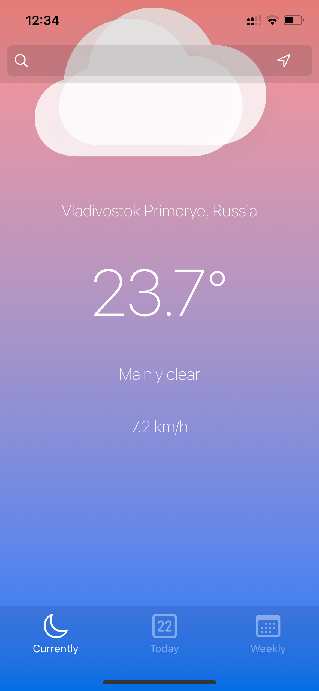
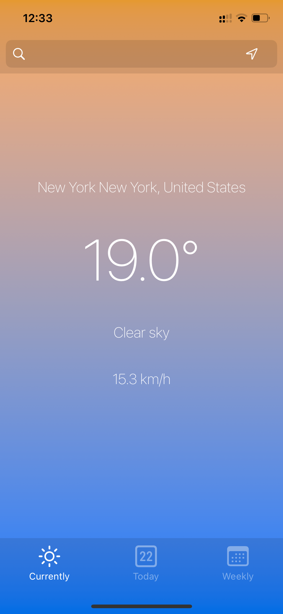
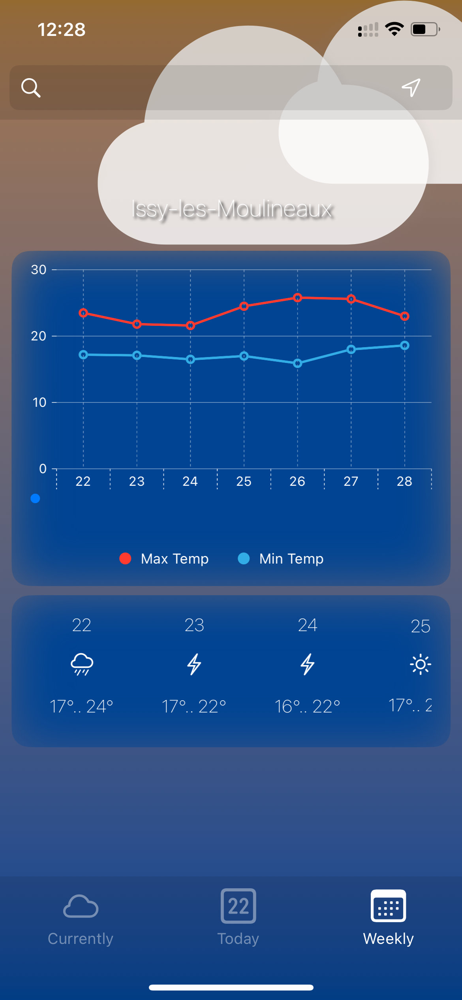

# Weather

Also a school project at 42. It uses a weather service API. Features include location detection, city search, dynamic weather display with animations for rain, snow, clouds, day and night, and detailed forecasts for the next 24 hours and the week.

  
  
  

  
  

